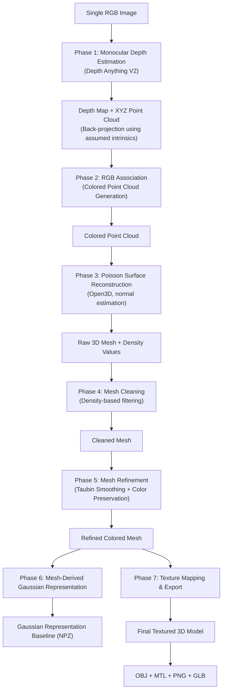

# Single-Image 3D Reconstruction

[]()
[]()
[]()
[]()

> A 7-phase experimental pipeline that reconstructs a colored 3D representation of a scene from a **single monocular RGB image**, progressing from depth estimation to a textured, exportable 3D asset.

---

## One-Line Pipeline

```
RGB Image → Depth → XYZ Point Cloud → Colored Point Cloud → Poisson Mesh → Mesh Cleaning → Mesh Refinement → Gaussian Representation → Texture Mapping → OBJ/GLB
```

---

## Table of Contents

1. [Project Overview](#project-overview)
2. [Motivation](#motivation)
3. [Research Problem](#research-problem)
4. [Objective](#objective)
5. [Key Research Questions](#key-research-questions)
6. [Complete Pipeline / Architecture](#complete-pipeline--architecture)
7. [Detailed Methodology](#detailed-methodology)
8. [Mathematical Formulation](#mathematical-formulation)
9. [Technologies and Libraries](#technologies-and-libraries)
10. [Project Structure](#project-structure)
11. [Installation](#installation)
12. [Requirements](#requirements)
13. [How to Run the Pipeline](#how-to-run-the-pipeline)
14. [Inputs and Outputs](#inputs-and-outputs)
15. [Experimental Parameters](#experimental-parameters)
16. [Research Design Decisions](#research-design-decisions)
17. [Results](#results)
18. [Evaluation and Validation](#evaluation-and-validation)
19. [Limitations](#limitations)
20. [Research Interpretation](#research-interpretation)
21. [Future Work](#future-work)
22. [Reproducibility](#reproducibility)
23. [Citation / References](#citation--references)
24. [License](#license)
25. [Acknowledgements](#acknowledgements)

---

## Project Overview

**Single-Image 3D Reconstruction** is a research-oriented, phase-based pipeline that converts a single 2D RGB photograph into a colored, textured 3D mesh and an experimental point-based (Gaussian) representation. Rather than relying on a single end-to-end neural network, the system decomposes the reconstruction problem into seven explicit, inspectable stages — monocular depth estimation, 3D point back-projection, colored point cloud construction, Poisson surface reconstruction, density-based mesh cleaning, mesh refinement, a mesh-derived Gaussian representation, and final texture mapping/export.

This project is intended as a **research and learning artifact**: every stage is implemented, logged, and analyzed independently so that intermediate outputs (depth maps, point clouds, raw meshes, cleaned meshes, refined meshes, Gaussian parameters, and textured models) can be inspected, compared, and evaluated in isolation.

> **Note:** This is a single-view, single-image pipeline. No multi-view stereo, structure-from-motion, or learned camera calibration is used. All 3D geometry is derived from one RGB image and one estimated depth map.

## Motivation

Recovering 3D structure from a single 2D image is a classical ill-posed problem in computer vision: a single image provides no direct depth or multi-view geometric constraint, and any reconstruction must rely on learned priors (in this case, a pretrained monocular depth network) rather than triangulation across views. Despite this ill-posedness, monocular 3D reconstruction is practically valuable — it removes the requirement for multiple cameras, calibration rigs, or video capture, and it is a natural testbed for understanding how modern depth-estimation networks, classical surface reconstruction algorithms (Poisson reconstruction), and emerging point-based rendering representations (3D Gaussian Splatting) relate to one another in a single, coherent pipeline.

This project was built to **study and implement**, stage by stage, the full path from a single RGB image to an exportable, texture-mapped 3D model — while being explicit about which parts of that path are learned, which are geometric/classical, and which are heuristic or approximate.

## Research Problem

> Given only a single RGB image with no calibrated camera parameters and no multi-view information, to what extent can a plausible, colored, textured 3D surface be reconstructed using a combination of monocular depth estimation and classical geometric surface reconstruction techniques?

## Objective

- Implement a complete, modular pipeline from single-image input to exportable 3D model.
- Use a pretrained monocular depth estimator (Depth Anything V2) rather than training a new depth network from scratch.
- Apply classical point cloud and mesh processing techniques (Poisson reconstruction, density filtering, Taubin smoothing) using Open3D.
- Construct a simple, mesh-derived point-based (Gaussian-style) representation as a baseline for future comparison with true 3D Gaussian Splatting.
- Produce standard, interoperable 3D export formats (OBJ, MTL, PNG, GLB) usable in common 3D viewers and engines.
- Clearly document assumptions (camera intrinsics), parameters, and limitations at every stage rather than presenting the system as a finished, production-grade reconstruction tool.

## Key Research Questions

1. How does depth predicted by a monocular depth network translate into a geometrically consistent 3D point cloud under assumed (uncalibrated) camera intrinsics?
2. How much of the original image's color information can be faithfully carried through a point cloud → mesh → refined mesh pipeline?
3. What is the practical effect of Poisson reconstruction depth and density-based filtering on mesh quality and noise?
4. How does a purely mesh-derived Gaussian-style representation (positions, scales, rotations, colors, opacities derived analytically from mesh geometry) differ from a properly optimized 3D Gaussian Splatting representation trained via photometric loss?
5. What are the fundamental limitations imposed by using only a single view, both geometrically (hidden/back-facing surfaces) and photometrically (texture projection)?

---

## Complete Pipeline / Architecture



Text form, as specified:

```
Single RGB Image
        ↓
Phase 1: Monocular Depth Estimation
        ↓
Depth Map + XYZ Point Cloud
        ↓
Phase 2: RGB Association
        ↓
Colored Point Cloud
        ↓
Phase 3: Poisson Surface Reconstruction
        ↓
Raw 3D Mesh + Density
        ↓
Phase 4: Mesh Cleaning
        ↓
Cleaned Mesh
        ↓
Phase 5: Mesh Refinement
        ↓
Refined Colored Mesh
        ↓
Phase 6: Mesh-Derived Gaussian Representation
        ↓
Gaussian Representation Baseline
        ↓
Phase 7: Texture Mapping & Export
        ↓
Final Textured 3D Model
        ↓
OBJ + MTL + PNG + GLB
```

---

## Detailed Methodology

### Phase 1 — Monocular Depth Estimation

**Location:** `phase1_depth_estimation/depth_estimation.py`

- **Input:** a single 2D RGB image (`asset/input_image.jpg`).
- **Model:** [Depth Anything V2](https://github.com/DepthAnything/Depth-Anything-V2), used as a pretrained monocular depth estimator to predict a per-pixel relative depth map from the RGB input.
- **Process:**
  1. Load the RGB image and preprocess it for the Depth Anything V2 model.
  2. Run inference to obtain a dense depth map of the same (or resized) spatial resolution as the input image.
  3. Back-project each pixel `(u, v)` with its estimated depth `Z` into 3D camera-space coordinates `(X, Y, Z)` using the pinhole camera model (see [Mathematical Formulation](#mathematical-formulation)).
- **Camera intrinsics used:**

  | Parameter | Value |
  |---|---|
  | `fx` | 612 |
  | `fy` | 612 |
  | `cx` | 306 |
  | `cy` | 204 |

  > ⚠️ **Assumption Notice:** These intrinsics are **assumed, fixed values** and are **not derived from camera calibration** (e.g., a checkerboard calibration procedure) and are **not read from image EXIF metadata**. They are a reasonable approximation used to make back-projection possible in the absence of known camera parameters. As a direct consequence, the resulting point cloud and mesh are **not metrically accurate** — they represent a plausible 3D structure under an assumed pinhole camera model, not a measured, real-world scale reconstruction.

- **Outputs:** an estimated depth map (image/array) and an initial (uncolored) XYZ point cloud, saved under `phase1_depth_estimation/outputs/`.

### Phase 2 — Colored Point Cloud Generation

**Location:** `phase2_colored_point_cloud/colored_point_cloud_generation.py`

- Loads the XYZ point cloud produced in Phase 1.
- Loads the original RGB image.
- For every valid 3D point, looks up the corresponding pixel in the original image (using the same `(u, v)` pixel indexing used during back-projection) and associates that pixel's color with the 3D point.
- Converts the image from OpenCV's default **BGR** channel ordering to **RGB**, since the point cloud color convention and downstream tools (Open3D, mesh export) expect RGB ordering.
- **Filtering:** removes points with non-positive or invalid depth (`Z ≤ 0` or `NaN`/`inf` values), since these correspond to failed depth predictions or background/undefined regions that cannot be meaningfully placed in 3D space.
- Produces a combined, colored 3D point cloud (`N × 3` XYZ positions paired with `N × 3` RGB colors).

**Why RGB preservation matters at this stage:** once a point cloud is converted into a mesh (Phase 3), the mesh generation algorithm (Poisson reconstruction) creates **entirely new vertices** that do not correspond one-to-one with the original point cloud. If color is not explicitly and carefully carried through the point cloud stage, it becomes significantly harder to recover reliable color information later, since the link between original pixel colors and new mesh geometry is weakened at every subsequent processing step. Preserving RGB at the earliest possible point maximizes the chance of a visually faithful final reconstruction.

### Phase 3 — Surface Reconstruction

**Location:** `phase3_surface_reconstruction/poisson_surface_reconstruction.py`

- **Library:** [Open3D](http://www.open3d.org/).
- **Process:**
  1. Load the colored point cloud from Phase 2 into an Open3D `PointCloud` object.
  2. Estimate per-point normals using a neighborhood/KNN-based normal estimation method (Open3D's `estimate_normals`, based on a local covariance/PCA analysis of each point's K nearest neighbors).
  3. Run **Poisson Surface Reconstruction** (`open3d.geometry.TriangleMesh.create_from_point_cloud_poisson`) using the estimated normals and a specified reconstruction depth parameter.
  4. Save the resulting raw triangle mesh and the per-vertex Poisson **density** values returned by the algorithm.

**Why convert a point cloud to a continuous surface/mesh?** A point cloud is an unordered, disconnected set of samples — it has no notion of surface connectivity, faces, or interior/exterior regions, which makes it unsuitable for rendering as a solid, shaded, textured object or for downstream mesh operations (smoothing, texturing, format export). Poisson reconstruction converts this discrete point sampling into a continuous, watertight-oriented triangle mesh by solving for an implicit function whose gradient best matches the estimated point normals, then extracting an isosurface from that function.

**Role of normals in Poisson reconstruction:** Poisson reconstruction is fundamentally a normal-driven algorithm — it solves a Poisson equation that relates the gradient of an implicit indicator function to the input point normals. Without reasonably consistent, correctly oriented normals, the reconstructed surface can be badly distorted, contain holes, or have inverted regions, since the algorithm has no other signal indicating which side of a point set is "outside" versus "inside."

> ⚠️ **Color is not automatically preserved by Poisson reconstruction.** Poisson reconstruction generates **new mesh vertices** that generally do not coincide with the original point cloud positions. As a result, the raw mesh output by this phase does not automatically inherit the original point cloud's per-point colors — color must be explicitly transferred or approximated in later phases (Phase 5), and this is treated as a separate, deliberate step rather than something Poisson reconstruction provides out of the box.

- **Parameter:** the Poisson reconstruction `depth` parameter controls the resolution/detail of the reconstructed mesh (higher depth → finer detail, more vertices, higher computational cost). In the current implementation, this value is a **manually specified, fixed parameter** — it is **not automatically tuned, searched, or optimized** based on the input point cloud's density or geometry.
- **Outputs:** the raw reconstructed mesh and the associated per-vertex Poisson density array, saved under `phase3_surface_reconstruction/outputs/`.

### Phase 4 — Mesh Cleaning

**Location:** `phase4_mesh_cleaning/density_based_mesh_cleaning.py`

- Loads the raw mesh and density values produced in Phase 3.
- Computes descriptive mesh statistics such as the axis-aligned bounding box, vertex/triangle counts, and surface area, and, where applicable, basic geometric properties (e.g., watertightness/edge-manifold checks provided by Open3D).
- **Density-based filtering:** Poisson reconstruction tends to extrapolate a surface even in regions with sparse or no underlying point-cloud support, producing low-confidence, often visually "blobby" or spurious geometry in those regions. The associated per-vertex density value is a proxy for how well-supported each part of the reconstructed surface is by the original point cloud. Vertices below a chosen density threshold are removed to eliminate these low-confidence regions.
- Several candidate density thresholds are compared (by inspecting resulting vertex/triangle counts and visual mesh quality) before a final threshold is selected for the cleaning step.
- After filtering, the following standard mesh cleanup operations are applied:
  - Removal of unreferenced vertices (vertices no longer used by any triangle after filtering).
  - Removal of duplicate/degenerate geometry (duplicate vertices, duplicate triangles, degenerate triangles) where applicable via Open3D's mesh cleanup utilities.
  - Recomputation of vertex normals, since normals computed on the raw mesh are no longer valid once vertices and triangles have been removed.

**Why density-based filtering is useful after Poisson reconstruction:** because Poisson reconstruction produces a *global* implicit surface, it will generate mesh geometry even in regions where the input point cloud gave little or no evidence for a surface (e.g., far outside the actual object silhouette, or in noisy/sparse regions). Density-based filtering is a practical way to trim this excess, low-confidence geometry without requiring a fully separate learned or hand-designed surface confidence model.

> ⚠️ **The selected density threshold is an empirical choice**, selected by visually and quantitatively comparing a small number of candidate thresholds on the specific reconstructed mesh. It is **not derived from a formal optimization procedure or a universally validated value**, and a different scene, point cloud density, or Poisson depth setting would likely require a different threshold.

- **Outputs:** the cleaned mesh, saved under `phase4_mesh_cleaning/outputs/`.

### Phase 5 — Mesh Refinement and Color Preservation

**Location:** `phase5_mesh_refinement/mesh_smoothing_and_color_transfer.py`

- Loads the cleaned mesh from Phase 4.
- Applies **Taubin smoothing** (`filter_smooth_taubin` in Open3D), a mesh-smoothing algorithm that alternates between shrinking and inflating smoothing passes to reduce high-frequency surface noise while limiting the volume shrinkage typical of simple Laplacian smoothing.
- Uses a **limited, fixed number of smoothing iterations**, chosen to reduce visible reconstruction noise (small bumps and jagged triangles introduced by Poisson reconstruction) while attempting to retain the coarse geometric shape of the object.
- Preserves per-vertex color/appearance information carried over from the cleaned mesh (and, transitively, from the original point cloud where a color-transfer relationship was established) so that the output of this phase is a **refined, colored mesh** rather than a purely geometric one.

**Why smoothing, and why not too much of it:** Poisson-reconstructed meshes, even after density filtering, typically contain small-scale surface noise inherited from imperfect normal estimates and discretization artifacts. Taubin smoothing reduces this noise and produces a visually cleaner surface. However, smoothing is a low-pass filtering operation on mesh geometry: applying too many iterations (or an aggressive smoothing factor) progressively removes genuine high-frequency surface detail along with noise, causing the mesh to look overly rounded or "melted" and to lose fine geometric features that may have been genuinely present in the underlying depth estimate. The iteration count is therefore deliberately kept limited/small rather than pushed to convergence.

> **Fundamental constraint:** regardless of how well Phase 5 smooths and colors the mesh, the refined mesh's geometric accuracy is still **fundamentally bounded by the quality of the Phase 1 monocular depth estimate and by the fact that only a single view of the scene was ever observed**. Smoothing and color transfer can improve visual presentation, but they cannot introduce genuine geometric information that was not present (or was incorrectly estimated) in the original depth map.

- **Outputs:** the refined, colored mesh, saved under `phase5_mesh_refinement/outputs/`.

### Phase 6 — Mesh-Derived Gaussian Representation

**Location:** `phase6_gaussian_representation/mesh_to_gaussian_representation.py`

This phase converts the refined mesh from Phase 5 into a **point-based, Gaussian-style representation**, structured analogously to the data format used by 3D Gaussian Splatting, but constructed **analytically from mesh geometry** rather than learned through optimization.

- **Positions:** each refined mesh vertex is used directly as the center (mean) of one Gaussian.
- **Scale:** each Gaussian's scale is estimated from the distances to that vertex's local nearest neighbors (a local spacing/density estimate), so that Gaussians in denser mesh regions are smaller and Gaussians in sparser regions are larger.
- **Color:** each Gaussian's color is taken directly from the corresponding refined mesh vertex color.
- **Rotation/orientation:** each Gaussian's orientation is derived from the mesh's per-vertex surface normal, aligning the Gaussian with the local surface tangent plane rather than being learned or optimized.
- **Opacity:** an opacity value is included as part of each Gaussian's parameters (as a fixed/derived scalar in the current implementation, rather than a learned parameter).
- **Storage:** the complete set of Gaussian parameters (positions, scales, rotations, colors, opacities) is serialized and stored as an `.npz` file for later loading/inspection.

> 🔴 **Important terminology clarification:** this component is explicitly referred to as a **"Mesh-Derived Gaussian Representation Baseline"**, and **not** as a full or optimized 3D Gaussian Splatting (3DGS) system. This distinction is central to the research framing of this project:
>
> | Aspect | This Implementation (Phase 6) | Full 3D Gaussian Splatting |
> |---|---|---|
> | Gaussian positions | Copied directly from mesh vertices | Initialized from SfM points, then optimized |
> | Gaussian scale/rotation | Estimated analytically from local mesh geometry (KNN distances, normals) | Learned via gradient-based optimization |
> | Gaussian color | Copied from mesh vertex color | Represented via learned spherical harmonics coefficients |
> | Opacity | Fixed/derived scalar | Learned parameter |
> | Training / optimization | **None** — no photometric loss, no rasterization-based gradient optimization | Iterative optimization against multi-view training images using a differentiable rasterizer |
> | Densification / pruning | Not implemented | Adaptive density control during training |
> | Multi-view supervision | Not used (single image only) | Required (typically dozens to hundreds of views) |
>
> **No iterative photometric optimization or training of Gaussian parameters is performed in the current implementation.** All Gaussian attributes are computed once, directly and deterministically from the refined mesh's geometry and color, with no rendering loss, no gradient descent, and no view-dependent refinement.

- **Outputs:** a `.npz` file containing the Gaussian parameter arrays, saved under `phase6_gaussian_representation/outputs/`.

### Phase 7 — Texture Mapping and Final 3D Model Export

**Location:** `phase7_texture_and_export/texture_mapping_and_model_export.py`

- Loads the refined, colored mesh from Phase 5.
- Uses the **original 2D RGB image** as the texture source (rather than relying solely on interpolated per-vertex colors).
- **Projects** each 3D mesh vertex back into the original image plane using the **same assumed camera intrinsics** (`fx = 612, fy = 612, cx = 306, cy = 204`) used for back-projection in Phase 1, via the forward pinhole projection equations.
- Converts these projected 2D image coordinates into normalized **UV texture coordinates** for each mesh vertex.
- Uses the resulting UV mapping to sample the original image as a texture applied across the mesh surface.
- **Exports** the final textured model in multiple standard, interoperable formats:

  | Format | Contents |
  |---|---|
  | `.obj` | Mesh geometry (vertices, faces, UV coordinates) |
  | `.mtl` | Material definition referencing the texture image |
  | `.png` | Texture image (derived from / equal to the original input image) |
  | `.glb` | Self-contained binary glTF asset packaging geometry, materials, and texture together |

**OBJ vs. GLB packaging:** an exported `.obj` file is a plain-text geometry description that, by convention, **references an external `.mtl` material file**, which in turn **references an external texture image file** (`.png`); all three files must be kept together for the textured model to display correctly in most viewers. A `.glb` file, in contrast, is a **binary glTF container** that packages geometry, material definitions, and texture image data into a **single self-contained file**, which is generally more convenient for distribution and for import into modern real-time engines and web-based 3D viewers.

> ⚠️ **Texture projection limitation:** because texture projection in this phase is based on a **single input image**, only the mesh surface regions that were visible in that original image can receive a meaningful, photographically grounded texture. Back-facing, occluded, or otherwise unseen surface regions have **no corresponding pixel information in the source image** and therefore cannot be genuinely textured from observed data — any color assigned to such regions (if any) is not a recovery of real appearance information, since that information was never captured in the first place.

- **Outputs:** the final textured 3D model (`.obj`, `.mtl`, `.png`, `.glb`), saved under `phase7_texture_and_export/outputs/`.

---

## Mathematical Formulation

### 1. Perspective Camera / Back-Projection Model

The pipeline uses the standard pinhole camera model. For a pixel at image coordinates `(u, v)` with estimated depth `Z` (from Phase 1), the corresponding 3D camera-space point `(X, Y, Z)` is obtained by **back-projection**:

```
X = (u - cx) * Z / fx
Y = (v - cy) * Z / fy
Z = Z            (directly from the depth map)
```

where:

- `(u, v)` — pixel coordinates in the image,
- `Z` — estimated depth at pixel `(u, v)`, from Depth Anything V2,
- `fx, fy` — focal lengths in pixel units (assumed: 612, 612),
- `cx, cy` — principal point offsets in pixel units (assumed: 306, 204).

Intuitively, this equation inverts the standard pinhole projection: instead of asking "where does a 3D point land in the image?", it asks "given a pixel and its depth, where in 3D space must the corresponding point be?" — recovering `X` and `Y` proportionally to how far the pixel is from the image's principal point, scaled by depth and focal length.

### 2. Forward Projection (used in Phase 7)

The inverse operation, used to project refined 3D mesh vertices back into the image plane for texture mapping:

```
u = (X * fx / Z) + cx
v = (Y * fy / Z) + cy
```

The resulting `(u, v)` pixel coordinates are normalized into `[0, 1]` UV texture coordinates using the image width and height:

```
U = u / image_width
V = v / image_height
```

### 3. Point Cloud Representation

The colored point cloud is represented as two aligned arrays:

```
P ∈ R^(N×3)   — 3D positions  [X_i, Y_i, Z_i]
C ∈ R^(N×3)   — RGB colors    [R_i, G_i, B_i], normalized to [0, 1]
```

for `i = 1 ... N` valid points (i.e., points with `Z_i > 0` and finite coordinates).

### 4. Surface Reconstruction (Poisson) — Concept

Poisson Surface Reconstruction estimates an implicit indicator function `χ(x)` (approximately 1 inside the surface, 0 outside) whose gradient best matches the oriented point normals `V(x)`:

```
∇χ ≈ V
```

This is solved via the associated Poisson equation:

```
∇²χ = ∇·V
```

The reconstructed mesh is then extracted as an isosurface of `χ` (conceptually similar to Marching Cubes). The `depth` parameter controls the resolution of the underlying octree used to discretize this problem, and hence the resolution/detail of the extracted mesh.

### 5. Mesh-Derived Gaussian Representation — Concept

For each mesh vertex `v_i` with position `p_i`, color `c_i`, and normal `n_i`, this project derives:

```
Gaussian_i = {
    mean      = p_i
    scale     = f(local KNN distances around p_i)
    rotation  = R(n_i)          # orientation aligned to local surface normal
    color     = c_i
    opacity   = α_i             # fixed/derived scalar
}
```

No parameter in this set is updated via gradient-based optimization in the current implementation — each is computed once, directly from mesh geometry.

### 6. UV Projection — Concept

UV texture coordinates for each mesh vertex are obtained by applying forward pinhole projection (Section 2 above) to map each 3D vertex back onto the 2D image plane, then normalizing by image resolution, so that the original image can be sampled as a texture at render time for any point on the mesh surface whose projection falls within the image bounds.

---

## Technologies and Libraries

| Category | Tool / Library |
|---|---|
| Monocular depth estimation | [Depth Anything V2](https://github.com/DepthAnything/Depth-Anything-V2) |
| Point cloud / mesh processing | [Open3D](http://www.open3d.org/) |
| Numerical computation | NumPy |
| Image I/O and color conversion | OpenCV (`cv2`) |
| 3D model export | Open3D I/O (`.obj`, `.mtl`, `.png`), glTF/GLB export utilities |
| Language | Python 3.9+ |

---

## Project Structure

```
single-image-3d-reconstruction/
│
├── asset/
│   └── input_image.jpg
│
├── models/
│   └── Depth-Anything-V2/
│
├── phase1_depth_estimation/
│   ├── depth_estimation.py
│   ├── research_notes.md
│   └── outputs/
│
├── phase2_colored_point_cloud/
│   ├── colored_point_cloud_generation.py
│   └── outputs/
│
├── phase3_surface_reconstruction/
│   ├── poisson_surface_reconstruction.py
│   └── outputs/
│
├── phase4_mesh_cleaning/
│   ├── density_based_mesh_cleaning.py
│   └── outputs/
│
├── phase5_mesh_refinement/
│   ├── mesh_smoothing_and_color_transfer.py
│   └── outputs/
│
├── phase6_gaussian_representation/
│   ├── mesh_to_gaussian_representation.py
│   └── outputs/
│
├── phase7_texture_and_export/
│   ├── texture_mapping_and_model_export.py
│   └── outputs/
│
├── requirements.txt
├── .gitignore
└── README.md
```

Each phase directory is self-contained: it holds the script implementing that phase and an `outputs/` folder where that phase's generated artifacts (depth maps, point clouds, meshes, `.npz` files, or final exports) are written, so that every stage of the pipeline can be inspected independently.

---

## Installation

```bash
# 1. Clone the repository
git clone https://github.com/<your-username>/single-image-3d-reconstruction.git
cd single-image-3d-reconstruction

# 2. Create and activate a virtual environment (recommended)
python -m venv venv
source venv/bin/activate        # On Windows: venv\Scripts\activate

# 3. Install dependencies
pip install -r requirements.txt

# 4. Obtain Depth Anything V2 weights
#    Place the pretrained Depth Anything V2 model files under:
#    models/Depth-Anything-V2/
```

## Requirements

Minimum expected contents of `requirements.txt`:

```
numpy
opencv-python
open3d
torch
torchvision
Pillow
trimesh
```

> Exact versions should be pinned in `requirements.txt` based on the environment used during development (e.g., the specific PyTorch/CUDA build compatible with the Depth Anything V2 checkpoint in use).

---

## How to Run the Pipeline

The pipeline is executed sequentially, phase by phase, since each phase consumes the output(s) of the previous phase.

```bash
# Phase 1 — Monocular Depth Estimation
python phase1_depth_estimation/depth_estimation.py

# Phase 2 — Colored Point Cloud Generation
python phase2_colored_point_cloud/colored_point_cloud_generation.py

# Phase 3 — Poisson Surface Reconstruction
python phase3_surface_reconstruction/poisson_surface_reconstruction.py

# Phase 4 — Density-Based Mesh Cleaning
python phase4_mesh_cleaning/density_based_mesh_cleaning.py

# Phase 5 — Mesh Refinement and Color Preservation
python phase5_mesh_refinement/mesh_smoothing_and_color_transfer.py

# Phase 6 — Mesh-Derived Gaussian Representation
python phase6_gaussian_representation/mesh_to_gaussian_representation.py

# Phase 7 — Texture Mapping and Final Export
python phase7_texture_and_export/texture_mapping_and_model_export.py
```

Each script reads its required inputs from the previous phase's `outputs/` directory and writes its own results into its own `outputs/` directory, so the phases can be re-run individually once their required upstream inputs exist.

---

## Inputs and Outputs

| Phase | Input(s) | Output(s) |
|---|---|---|
| **1 — Depth Estimation** | Single RGB image (`asset/input_image.jpg`) | Estimated depth map; initial XYZ point cloud |
| **2 — Colored Point Cloud** | XYZ point cloud (Phase 1); original RGB image | Filtered XYZ points, RGB values, combined colored point cloud |
| **3 — Surface Reconstruction** | Colored point cloud (Phase 2) | Raw triangle mesh; per-vertex Poisson density values |
| **4 — Mesh Cleaning** | Raw mesh + density values (Phase 3) | Cleaned mesh (filtered, deduplicated, renormalized) |
| **5 — Mesh Refinement** | Cleaned mesh (Phase 4) | Refined, colored (Taubin-smoothed) mesh |
| **6 — Gaussian Representation** | Refined mesh (Phase 5) | Gaussian parameter set (`.npz`: positions, scales, rotations, colors, opacities) |
| **7 — Texture Mapping & Export** | Refined mesh (Phase 5); original RGB image | `.obj`, `.mtl`, `.png` texture, `.glb` |

---

## Experimental Parameters

| Parameter | Used In | Value / Setting | Notes |
|---|---|---|---|
| `fx`, `fy` (focal length) | Phases 1, 7 | 612, 612 | Assumed, not calibrated |
| `cx`, `cy` (principal point) | Phases 1, 7 | 306, 204 | Assumed, not calibrated |
| KNN neighborhood size | Phase 3 (normal estimation), Phase 6 (scale estimation) | Fixed integer, set in script | Controls locality of normal/scale estimates |
| Poisson reconstruction depth | Phase 3 | Fixed integer, set in script | Manually selected; not auto-tuned |
| Density threshold | Phase 4 | Empirically selected after comparing candidates | Not a universally optimal value |
| Taubin smoothing iterations | Phase 5 | Small, fixed integer | Kept low to avoid detail loss |
| Gaussian scale basis | Phase 6 | Local KNN distance statistics | Analytical, not learned |
| Gaussian opacity | Phase 6 | Fixed/derived scalar | Not a learned/optimized parameter |

> Exact numeric values for KNN size, Poisson depth, density threshold, and smoothing iteration count are defined directly in each phase's script and should be read from the corresponding source file, as they may be adjusted between experimental runs.

---

## Research Design Decisions

**Why monocular depth estimation?**
A single RGB image provides no direct depth signal. Using a pretrained monocular depth network (Depth Anything V2) allows the pipeline to obtain a per-pixel depth estimate without requiring stereo pairs, multi-view capture, or an active depth sensor — at the cost of depth accuracy being entirely dependent on the network's learned priors rather than measured geometry.

**Why point clouds as an intermediate representation?**
Back-projected 3D points form the most direct, minimally processed representation of the depth map's implied geometry. Using an explicit point cloud (rather than, e.g., directly meshing per-pixel depth) makes it straightforward to filter invalid points, associate color, and hand the data to standard point-cloud-based reconstruction algorithms such as Poisson reconstruction.

**Why Poisson reconstruction specifically?**
Poisson reconstruction is a well-established, robust classical method for converting oriented point clouds into watertight-oriented triangle meshes, and is natively supported by Open3D. It tends to produce smoother, more globally consistent surfaces than purely local triangulation methods (e.g., ball-pivoting) when point normals are reasonably well estimated, which is useful given that the input point cloud's normal estimates are themselves approximate.

**Why density-based filtering?**
Poisson reconstruction extrapolates a global surface, including in regions with little or no real point-cloud support. Density-based filtering is a simple, effective, non-learned way to strip out this low-confidence geometry using information (density) that Poisson reconstruction already computes as part of its output.

**Why Taubin smoothing?**
Taubin smoothing was chosen over simple Laplacian smoothing because it explicitly alternates shrink/inflate steps to counteract the volume shrinkage that repeated Laplacian smoothing tends to introduce, making it more suitable for a small number of iterations aimed at denoising without significantly distorting the object's overall scale/shape.

**Why texture projection (Phase 7) rather than relying only on per-vertex mesh colors?**
Per-vertex colors are limited by mesh resolution and by how well color survived the point cloud → mesh → cleaning → smoothing chain. Projecting the original image directly onto the mesh as a texture (where visible) generally produces a sharper, more photographically faithful appearance for the visible surface than interpolated per-vertex color alone, and produces standard texture-mapped export formats usable in common 3D tools.

---

## Results

The output of this pipeline, for a given single input image, is:

- An estimated monocular depth map.
- A colored 3D point cloud approximating the visible surface geometry implied by that depth map.
- A reconstructed, cleaned, and smoothed 3D mesh of the visible surface.
- A mesh-derived Gaussian-style parameter set (`.npz`) representing the same geometry in a point-based format.
- A textured 3D model (OBJ/MTL/PNG/GLB) with the original image projected onto the mesh as a texture.

The reconstructed model should be understood as a **plausible 3D approximation of the visible surface(s) in the input image**, under an assumed camera model — not as a metrically accurate, fully closed 3D scan of the object or scene.

**Screenshot placeholders** *(to be filled in after running the pipeline on a specific input image):*

- Depth map: `[INSERT DEPTH MAP]`
- Point cloud: `[INSERT POINT CLOUD]`
- Raw Poisson mesh: `[INSERT RAW MESH]`
- Cleaned mesh: `[INSERT CLEANED MESH]`
- Refined mesh: `[INSERT REFINED MESH]`
- Final textured model: `[INSERT FINAL TEXTURED MODEL]`

---

## Evaluation and Validation

The current implementation performs **qualitative and structural** evaluation rather than quantitative benchmark evaluation:

- **Geometric validity:** basic mesh diagnostics (vertex/triangle counts, bounding box, and, where applicable, manifold/edge-connectivity checks provided by Open3D) are computed at the mesh-cleaning stage (Phase 4) to sanity-check the reconstructed geometry.
- **Point/mesh statistics:** vertex and triangle counts are tracked across Phases 3–5 to observe how filtering and smoothing affect mesh size and complexity.
- **Density analysis:** multiple density thresholds are compared in Phase 4 (by inspecting resulting mesh size and visual quality) before a final threshold is chosen.
- **Visual quality:** evaluation of depth maps, point clouds, and meshes at each stage is currently performed through direct visual inspection (e.g., via Open3D's visualizer) rather than automated visual-quality metrics.
- **Reconstruction limitations:** discussed in detail in the [Limitations](#limitations) section below.

> **No quantitative ground-truth metrics (e.g., Chamfer distance, depth RMSE, PSNR/SSIM against a reference reconstruction, or similar benchmark scores) are currently implemented or reported in this project.** No such values should be inferred or assumed from this README; if quantitative evaluation is added in the future, it will require a ground-truth 3D model or depth map to compare against, which the current pipeline does not use or possess.

---

## Limitations

- **Single-view ambiguity:** a single 2D image fundamentally under-constrains 3D geometry; any reconstruction is only ever an approximation consistent with what the depth network inferred from that one view.
- **Assumed (uncalibrated) camera intrinsics:** `fx`, `fy`, `cx`, `cy` are fixed, assumed values, not calibrated from the actual capturing camera, so absolute scale and precise geometric proportions of the reconstruction are not guaranteed to be accurate.
- **Monocular depth uncertainty:** Depth Anything V2, like all monocular depth estimators, produces a learned depth *estimate*, not a measured depth; errors, ambiguities, and biases in this estimate propagate directly into the 3D reconstruction.
- **Hidden / back-facing geometry:** surfaces not visible in the input image have no corresponding depth or color information and are not genuinely reconstructed — any geometry or texture inferred for such regions (via Poisson extrapolation or otherwise) is not grounded in observed data.
- **Texture projection limitations:** texture is only meaningfully defined for mesh regions visible in the original image; back-facing or occluded regions cannot receive genuine photographic texture.
- **Poisson reconstruction artifacts:** Poisson reconstruction can introduce spurious surface extrapolation in low-support regions (partially mitigated, but not fully eliminated, by density-based filtering in Phase 4).
- **Smoothing / detail loss:** Taubin smoothing, even with a limited number of iterations, trades off some fine geometric detail in exchange for reduced noise.
- **Gaussian representation is not optimized 3DGS:** the Phase 6 representation is a deterministic, mesh-derived baseline with no photometric training, densification, or pruning — it should not be compared directly against results from a trained 3D Gaussian Splatting pipeline.

---

## Research Interpretation

This project genuinely demonstrates:

- A complete, working, modular pipeline from a single RGB image to an exportable, textured 3D model, integrating a pretrained monocular depth network with classical point cloud and mesh processing techniques via Open3D.
- Explicit, inspectable intermediate representations (depth map, point cloud, raw mesh, cleaned mesh, refined mesh, mesh-derived Gaussian parameters, textured export) at every stage of the reconstruction process.
- A concrete, code-level illustration of how monocular depth, camera back-projection, Poisson surface reconstruction, density-based filtering, Taubin smoothing, and UV-based texture projection relate to one another within a single reconstruction pipeline.
- A clearly scoped, analytically constructed (non-learned) baseline point-based representation, positioned explicitly as a stepping stone toward, rather than an implementation of, full 3D Gaussian Splatting.

This project does **not** demonstrate (and does not claim to demonstrate):

- Metrically accurate, calibrated 3D reconstruction.
- Complete or ground-truth-validated 3D geometry, including for unseen/occluded surfaces.
- State-of-the-art reconstruction quality relative to published multi-view or learned reconstruction methods.
- A trained or optimized 3D Gaussian Splatting model.
- Quantitatively benchmarked reconstruction accuracy against any ground-truth dataset.

---

## Future Work

- Replace assumed camera intrinsics with **calibrated camera parameters** (e.g., via a standard checkerboard calibration procedure or EXIF-derived focal length, where available).
- Extend the pipeline to **multi-view reconstruction** (multiple images of the same scene/object) to address single-view ambiguity and recover previously hidden surfaces.
- Explore **learned or optimization-based surface reconstruction** methods (e.g., neural implicit surfaces) as an alternative or complement to classical Poisson reconstruction.
- Implement **visibility-aware texture mapping** that explicitly flags or handles mesh regions with no valid projected texture, rather than leaving them under-defined.
- Add explicit **UV seam handling** for smoother texture continuity across mesh charts/islands.
- Implement an **actual optimized 3D Gaussian Splatting pipeline** (photometric loss, differentiable rasterization, densification/pruning) using the current mesh-derived Gaussians only as an initialization baseline.
- Introduce **quantitative benchmark evaluation** (e.g., against ground-truth depth or 3D scans) once suitable reference data is available.
- Perform a **systematic comparison against alternative single-image and multi-view reconstruction methods** from the literature.

---

## Reproducibility

- All phase scripts are deterministic given fixed input data and fixed parameters (KNN size, Poisson depth, density threshold, smoothing iterations), except for any inherent non-determinism in the underlying depth network's inference (e.g., due to hardware/backend differences) or in Open3D's internal algorithms.
- Each phase writes its outputs to a dedicated `outputs/` directory, allowing any single phase to be re-run and re-inspected independently, provided its required upstream inputs exist.
- To fully reproduce a result end-to-end, run all seven phase scripts in order (see [How to Run the Pipeline](#how-to-run-the-pipeline)) on the same input image with the same parameter settings.
- Exact parameter values (Poisson depth, density threshold, KNN size, smoothing iterations) used for a given run should be recorded alongside that run's outputs, since they directly affect the resulting geometry.

---

## Citation / References

- **Depth Anything V2** — L. Yang, B. Kang, Z. Huang, Z. Zhao, X. Xu, J. Feng, H. Zhao. *Depth Anything V2*. [https://github.com/DepthAnything/Depth-Anything-V2](https://github.com/DepthAnything/Depth-Anything-V2)
- **Open3D** — Q.-Y. Zhou, J. Park, V. Koltun. *Open3D: A Modern Library for 3D Data Processing*. [http://www.open3d.org/](http://www.open3d.org/)
- **Poisson Surface Reconstruction** — M. Kazhdan, M. Bolitho, H. Hoppe. *Poisson Surface Reconstruction*. Eurographics Symposium on Geometry Processing, 2006.
- **Taubin Smoothing** — G. Taubin. *A Signal Processing Approach to Fair Surface Design*. SIGGRAPH, 1995.
- **3D Gaussian Splatting** (referenced for context and terminology only; not implemented in full here) — B. Kerbl, G. Kopanas, T. Leimkühler, G. Drettakis. *3D Gaussian Splatting for Real-Time Radiance Field Rendering*. SIGGRAPH, 2023.


## Acknowledgements

- The [Depth Anything V2](https://github.com/DepthAnything/Depth-Anything-V2) authors and contributors, for the pretrained monocular depth estimation model used in Phase 1.
- The [Open3D](http://www.open3d.org/) project, for point cloud and mesh processing utilities used throughout Phases 3–5.
- The broader classical 3D reconstruction and neural rendering research communities, whose foundational work (Poisson reconstruction, Taubin smoothing, 3D Gaussian Splatting) shaped the design and terminology of this pipeline.

---

## Research Status

| Aspect | Status |
|---|---|
| Pipeline completeness (Phases 1–7) | ✅ Implemented end-to-end |
| Camera calibration | ❌ Not implemented — assumed intrinsics only |
| Multi-view reconstruction | ❌ Not implemented — single image only |
| Learned/optimized surface reconstruction | ❌ Not implemented — classical Poisson reconstruction only |
| Optimized 3D Gaussian Splatting | ❌ Not implemented — mesh-derived baseline only |
| Quantitative benchmark evaluation | ❌ Not implemented — qualitative/structural evaluation only |
| Standard 3D export (OBJ/MTL/PNG/GLB) | ✅ Implemented |

**Overall status:** experimental research pipeline, complete through all seven defined phases, with clearly identified assumptions and open directions for future work. **Not intended as a production-ready or metrically accurate 3D reconstruction system.**

## Current Implementation vs. Future Work

| Component | Current Implementation | Future Work |
|---|---|---|
| Camera parameters | Fixed, assumed intrinsics (`fx=612, fy=612, cx=306, cy=204`) | Calibrated intrinsics (checkerboard calibration or EXIF-derived) |
| Input | Single RGB image | Multiple images / multi-view capture |
| Depth estimation | Pretrained Depth Anything V2 (inference only) | Fine-tuned or scene-specific depth estimation |
| Surface reconstruction | Classical Poisson reconstruction (Open3D) | Learned/optimization-based implicit surface reconstruction |
| Mesh cleaning | Manual, empirically chosen density threshold | Automated/adaptive thresholding |
| Mesh refinement | Fixed-iteration Taubin smoothing | Detail-preserving or adaptive smoothing |
| Point-based representation | Mesh-derived Gaussian baseline (no training) | Fully optimized 3D Gaussian Splatting (photometric training, densification, pruning) |
| Texture mapping | Single-image forward projection to UV | Visibility-aware, multi-source texture mapping with seam handling |
| Evaluation | Qualitative/structural (statistics, visual inspection) | Quantitative benchmark evaluation against ground truth |

